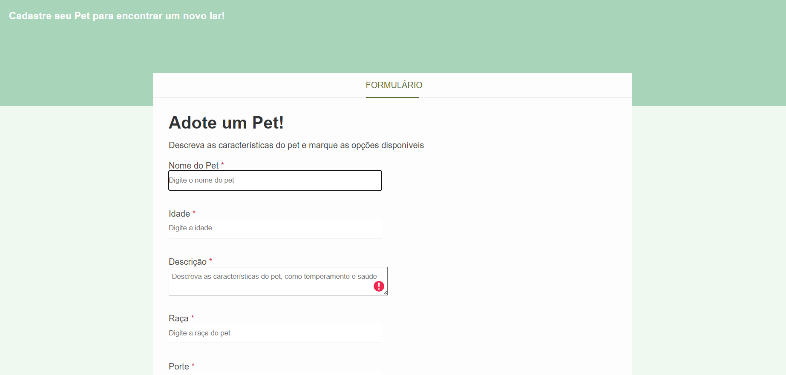

# 🐶 AdotaPet - Formulário de Cadastro para Adoção Animal

  
  
  
  

# 🐾 Formulário de Adoção Animal  

**Projeto adaptado** do curso "Hora de Codar", transformando um formulário de vendas de carros em uma plataforma para **ajudar pets a encontrarem um novo lar!**  

## 🚧 Status do Projeto

Este é um **projeto front-end estático** com as seguintes características:
- ✅ Layout completo e responsivo
- ✅ Validação básica de campos (HTML5)
- ✅ Estilização moderna com CSS3
- ❌ Funcionalidade de envio (backend não implementado)

## 🚧 Limitações Atuais

> ⚠️ **Importante:** Esta versão funciona como protótipo visual. Para operação completa seria necessário:
> - Desenvolvimento de backend para armazenamento
> - Integração com sistema de autenticação
> - Implementação de segurança para uploads

